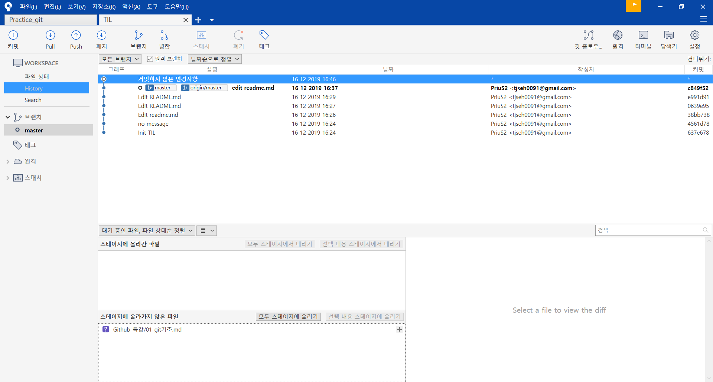

# Git 기초

2019-12-16 github 특강 / 유태영 강사


## SCM이란?

Source Code Manager 의 약자로, 코드의 버전을 관리하기 위해 존재한다.


### Git

git은 Linus Torvalds가 만든 SCM으로, 현재 가장 많이 사용된다.


### github

github는 git이 관리하는 Repo의 원격 저장소를 제공하는 서비스다. 가장 많이 사용하며, OpenSource 프로젝트들이 성장하는 곳이다. 최근 MS에 인수되었다.


## SourceTree





### 커밋?


### Pull


### Push


```c#
public class qwer(){
    print("asdf");
}
```

