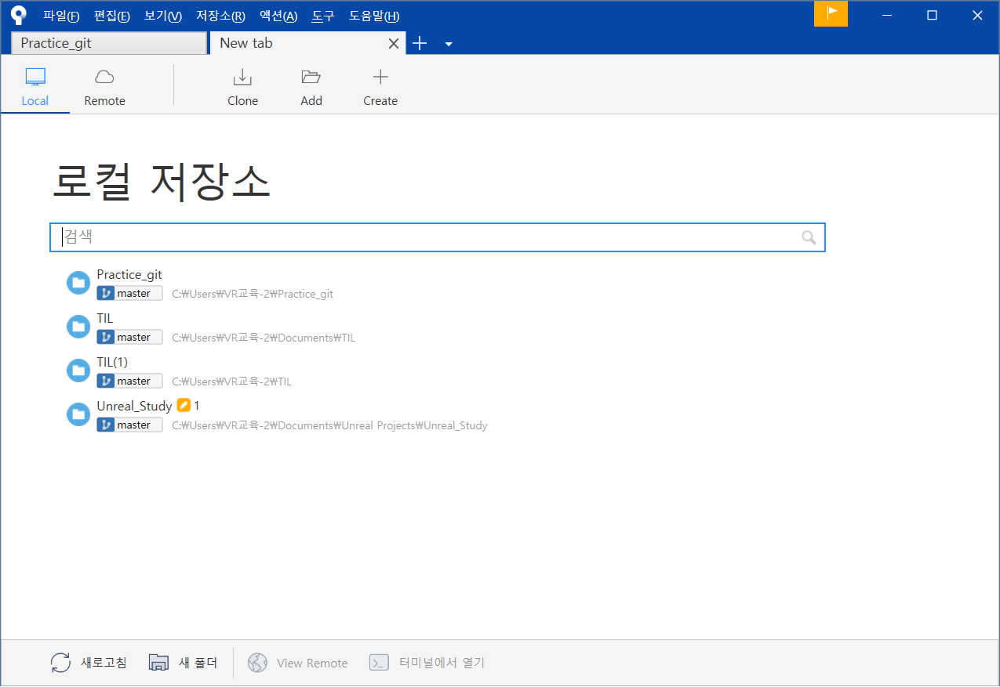
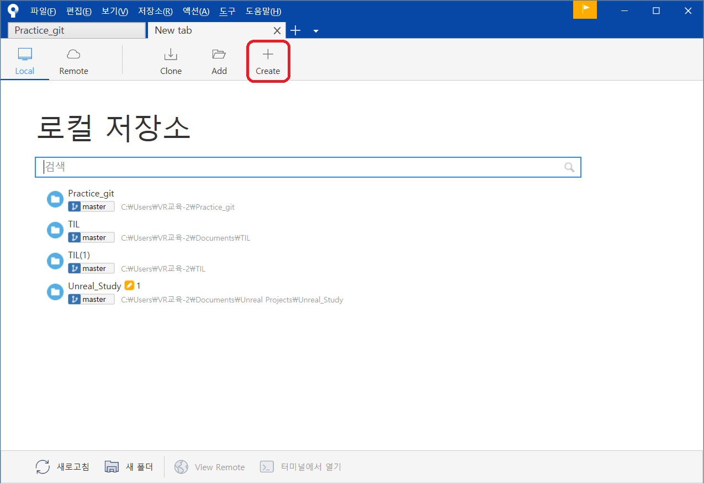
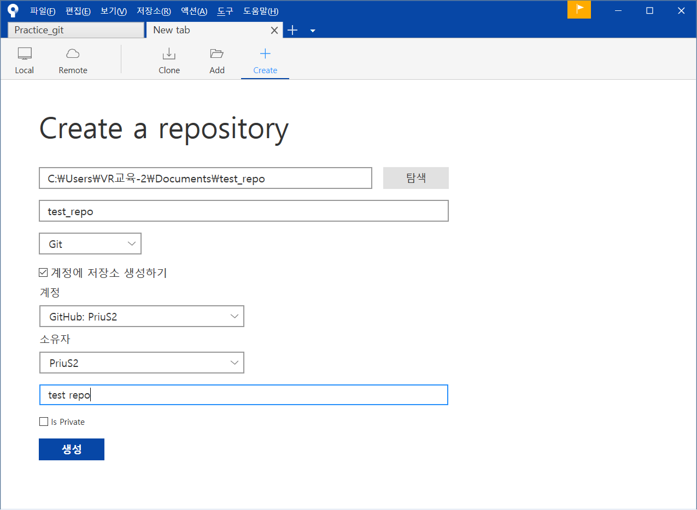
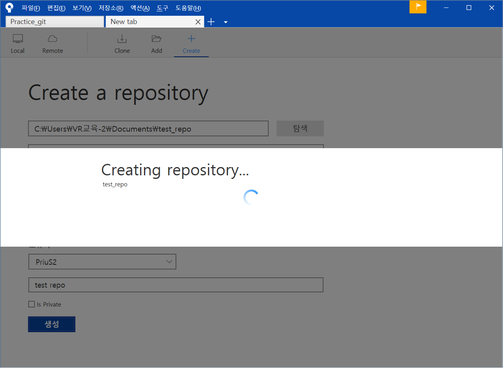
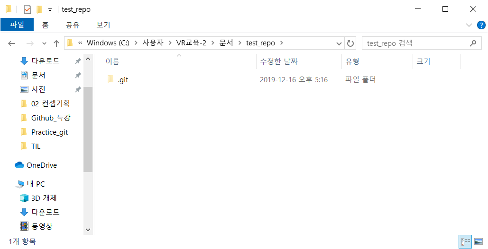
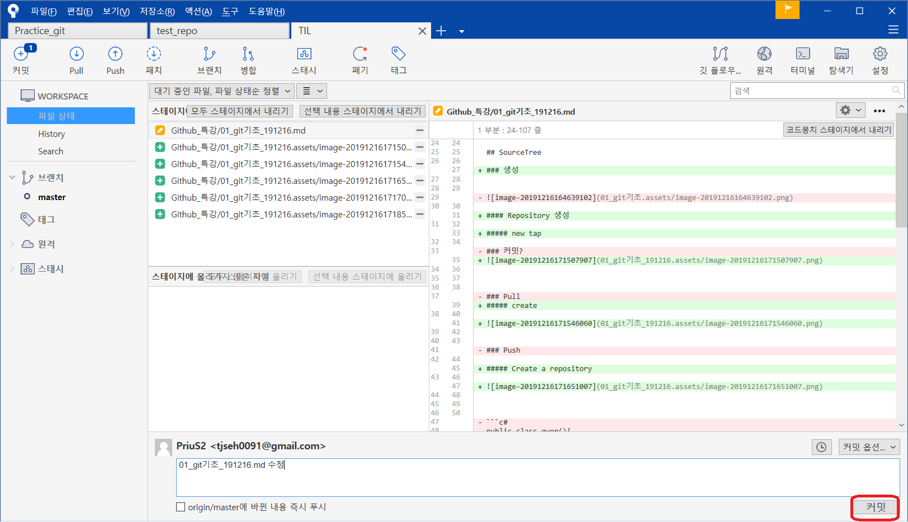
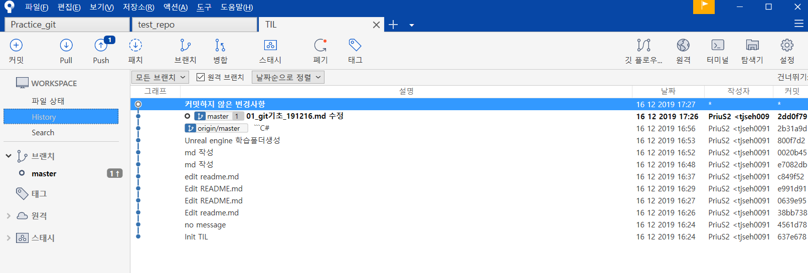
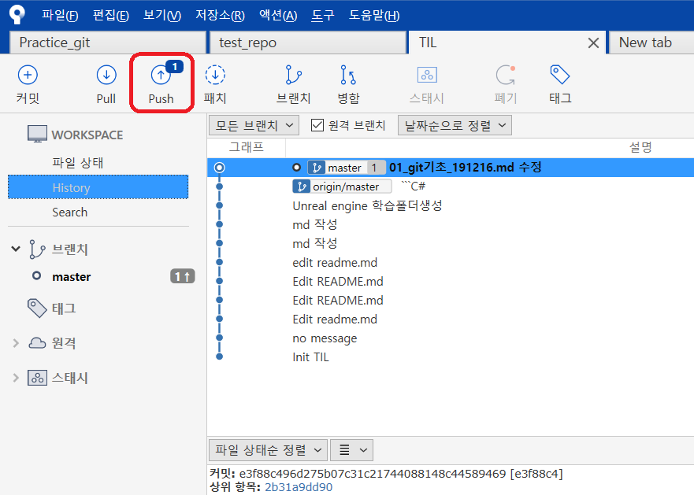

# Git 기초

2019-12-16 github 특강 / 유태영 강사


## SCM이란?

Source Code Manager 의 약자로, 코드의 버전을 관리하기 위해 존재한다.


### Git

git은 Linus Torvalds가 만든 SCM으로, 현재 가장 많이 사용된다.


### github

github는 git이 관리하는 Repo의 원격 저장소를 제공하는 서비스다. 가장 많이 사용하며, OpenSource 프로젝트들이 성장하는 곳이다. 최근 MS에 인수되었다.


## SourceTree

git / mercurial을 GUI로 조작이 가능하게 해준다. 명령어로 할일을 간편하게 할 수 있다.

### 생성

#### Repository 생성

##### new tap




##### create




##### Create a repository







##### directory




### 관리

#### .gitignore이란?

Project에 원하지 않는 Backup File이나 Log File , 혹은 컴파일 된 파일들을 Git에서 제외시킬수 있는 설정 File이다.

최상위 디렉토리에 존재해야한다.

##### 문법

```python
# : comments

# no .a files
*.a

# but do track lib.a, even though you're ignoring .a files above
!lib.a

# only ignore the TODO file in the current directory, not subdir/TODO
/TODO

# ignore all files in the build/ directory
build/

# ignore doc/notes.txt, but not doc/server/arch.txt
doc/*.txt

# ignore all .pdf files in the doc/ directory
doc/**/*.pdf
```


#### 커밋? 

파일 및 폴더의 추가/변경 사항을 저장소에 기록하려면 '커밋'이란 버튼을 눌러줘야 한다

커밋 버튼을 누르면 이전 커밋 상태부터 현재 상태까지의 변경 이력이 기록된 커밋(혹은 리비전)이 만들어진다.

커밋은 아래 그림처럼 시간순으로 저장됩니다. 최근 커밋부터 거슬러 올라가면 과거 변경 이력과 내용을 알 수 있다.



##### History

history에 지금까지 커밋한 내역이 저장되있다.



#### Push

변경사항을 git서버의 repository에 업로드해 동기화 시킨다.



#### Pull

git서버에서 변경사항을 다운로드해 동기화시킨다.