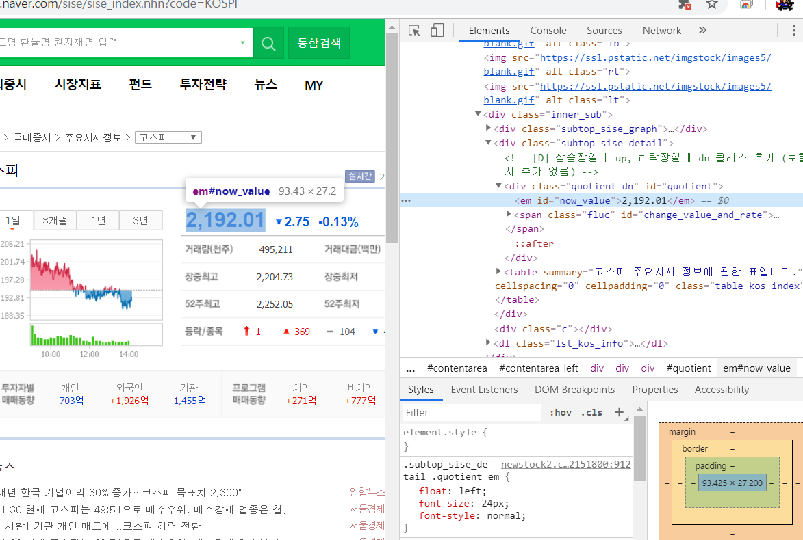
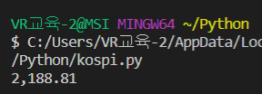
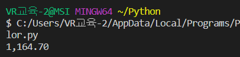

# Github 특강 4일차 (19.12.19)

* python (3.8.0) 설치 - path 추가 체크


## 문자열 표현

```python
nameKr = '박선도'
nameEn = 'Park Sundo'
  
aaaaa = '저는' + nameKr + '입니다. my name is' + nameEn
bbbbb = '저는 {} 입니다. my name is {}'.format(nameKr, nameEn)
ccccc = f'저는 {nameKr} 입니다. my name is {nameEn}'

#result : 저는 박선도입니다. my name is Park Sundo
```

  문자열 2번째 3번째처럼 표현하는 방법을 배웠다.


## 크롤링

네이버 코스피 (https://finance.naver.com/sise/sise_index.nhn?code=KOSPI)



코스피 현재값의 id는 now_value임을 알 수 있음


### 모듈 설치

* pip install requests
  - 간편한 HTTP 요청처리를 위해 사용하는 모듈

* pip install bs4
  - html text를 내가 보기 좋게 접근할 수 있도록 변경해주는 모듈


### 크롤링 예제

```python
#모듈추가
import requests
import bs4

# 이 주소로 요청을 보내면 응답으로 html 파일이 도착할것
html = requests.get('https://finance.naver.com/sise/sise_index.nhn?code=KOSPI')

#html text를 내가 보기 좋게 접근할 수 있도록 변경
soup = bs4.BeautifulSoup(html.text, 'html.parser')

#
kospi = soup.select_one('#now_value')

print(kospi.text)
```
* 출력
  


### 크롤링 실습(달러 환율)
```python
#
import requests
import bs4

# 이 주소로 요청을 보내면 응답으로 html 파일이 도착할것
html = requests.get('https://m.stock.naver.com/marketindex/item.nhn?marketindexCd=FX_USDKRW&menu=exchange')

#html text를 내가 보기 좋게 접근할 수 있도록 변경
soup = bs4.BeautifulSoup(html.text, 'html.parser')
dollor = soup.select_one('#header > div.major_info_wrp.no_chart.no_code > div.major_info > div.stock_wrp > div > strong')

print(dollor.text)
```

* 출력

   


