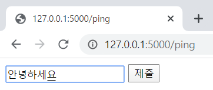

# Github 특강 4일차 (19.12.19)

## Flask

* Flask는 Python 으로 구동되는 웹 어플리케이션 프레임워크이다.
* 가볍고 스케일이 작은 서버부터 큰 서버까지 만들 수 있다.

* https://www.palletsprojects.com/p/flask/

* 모듈 설치

  ```pip install flask```


* 사용 모듈

```python
from flask import Flask, escape, request, render_template
import random
import requests
import json
```


## 실습

### 기본

1) 루트

```python
@app.route('/')
def hello():
    name = request.args.get("name", "World")
    return f'Hello, {escape(name)}!'
```


2) 

```python
@app.route('/myname')
def myname():
    return '박선도입니다'
```


3) 

```python
@app.route('/lunch')
def lunch():
    menus = ['111', '222', '333', '444']
    lunch = random.choice(menus)
    return lunch

```


4) json

크롬 jason viewer 확장프로그램 설치

https://chrome.google.com/webstore/detail/json-viewer/aimiinbnnkboelefkjlenlgimcabobli

```python
@app.route('/idol')
def Idol():
    idol = {
        'AAA' : {
            '111' : 1,
            '222' : 2,
        },
        'BBB' : {
            '333' : 333,
            '444' : 444
        },
        'CCC' : ['111', '222', '333']
    }
    return idol
```


### 동적 라우팅

1)

```python
@app.route('/post/<int:num>')
def post(num):
    posts = ['0번 포스트', '1번 포스트', '2번 포스트']
    return posts[num]

```


2)


```python
# 실습 cube뒤에 전달된 수의 세제곱 수를 화면에 보여주세요
@app.route('/cube/<int:num>')
def cube(num):
    return str(num**3)
```


### html 라우팅

templates 폴더생성 후 index.html 생성

```python
@app.route('/html')
def html():
    return render_template('index.html')
```


**(옵션)**

깨지는 문제가 생김...

set Flask param

```app = Flask(__name__, :parm)```

```python
#ex)
app = Flask(__name__, static_folder='static',
            template_folder='templates', static_url_path='')
```


bootstrap template을 넣어 보았다.


### ping! pong!

```python
@app.route('/ping')
def pint():
    return render_template('ping.html')

@app.route('/pong')
def pong():
    age = request.args.get('age')
    return render_template('pong.html', age_in_html=age)
```


* ping.html

```html
<form action="/pong">
    <input type="text" name = "age">
    <input type="submit">
</form>
```

* pong.html

```html
<h1>Pong! {{age_in_html}}</h1>
```

1)


2) 입력, 제출



3)


### api 사용

```python
import requests
```

```python
#로또 번호를 가져와서 보여주는 서버
@app.route('/lotto_result/<int:round>')
def lotto_result(round):
    url = f'https://www.nlotto.co.kr/common.do?method=getLottoNumber&drwNo={round}'
    result = requests.get(url).json()

    winner = []
    for i in range(1,7):
        #없는거 찾으면 null로 나옴
        winner.append(result.get(f'drwtNo{i}'))
        #없는거 찾으면 에러남(아래)
        # winner.append(result[f'drwtNo{i}'])
    winner.append(result.get('bnusNo'))

    return json.dumps(winner)
```


* 800회차 요청


* 없는 회차 요청시 null 출력

