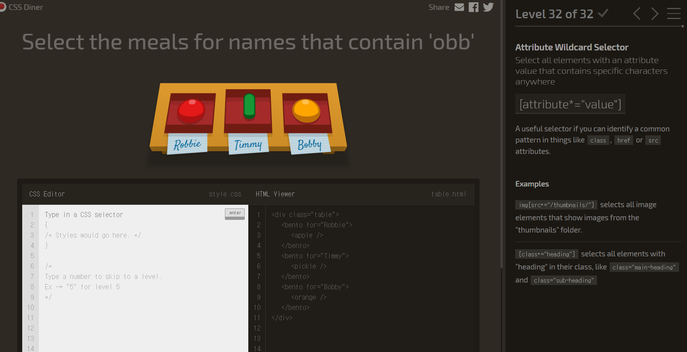
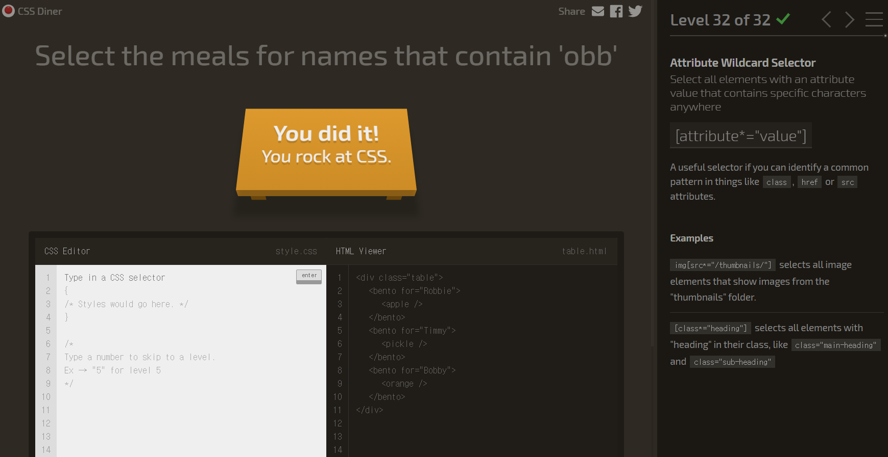

# Github 특강 3일차 (19.12.18)

## Github

### 컨트리뷰터

해당 git프록젝트에 기여한 사람

### fork

fork는 다른 사람의 Github repository에서 내가 어떤 부분을 수정하거나 추가 기능을 넣고 싶을 때 해당 respository를 내 Github repository로 그대로 복제하는 기능이다. fork한 저장소는 원본(다른 사람의 github repository)와 연결되어 있다. 

### PR

### GitHub Pages

[GitHub Pages](https://pages.github.com/)는 GitHub에서 제공하는 Static Website로 GitHub repository에 리소스를 push하는 것 만으로 간단히 웹사이트를 만들 수 있다.

Static Website이므로 Database 등은 사용할 수 없으나 무료로 유지보수가 간편한 Website를 Hosting할 수 있다는 장점이 있다.

GitHub Pages는 HTML, CSS, Javascript만으로도 웹사이트를 구축할 수 있으나 markdown을 사용하여 웹사이트를 generate하기 위해 Jelyll을 지원한다.

로컬 환경에서 Jelyll을 사용하여 웹사이트를 작성/테스트하고 GitHub repository에 웹리소스를 push하면 매우 간단히 Website를 Hosting할 수 있는 구조이다.

나의 GitHub Page

https://prius2.github.io/

서비스

## 기타

### 게임으로 CSS 선택자 공부

CSS 선택자를 32단계의 게임으로 공부할 수 있다.

32단계까지 깨기는 했지만 아직 확실히는 모르겠다.

http://flukeout.github.io/

### Bootstrap

#### bootstrap

Bootstrap은 빠르고 간편한 반응형 웹 디자인(responsive web design)을 위한 open-source front-end framework이다. HTML, CSS, JavaScript로 만들어진 typography, 입력 양식(forms), 버튼, 테이블, 탭, 내비게이션, 모달, 이미지 캐러셀(image carousel) 등을 제공하며 추가적으로 JavaScript plugin들을 제공한다. Twitter의 Mark Otto와 Jacob Thornton이 개발한 오픈 소스로 2011년 공개되었다.

https://getbootstrap.com/

#### bootstrap portfolio

bootstrap으로 제작된 포트폴리오 예제들이 올라와 있다.

https://startbootstrap.com/themes/portfolio-resume/